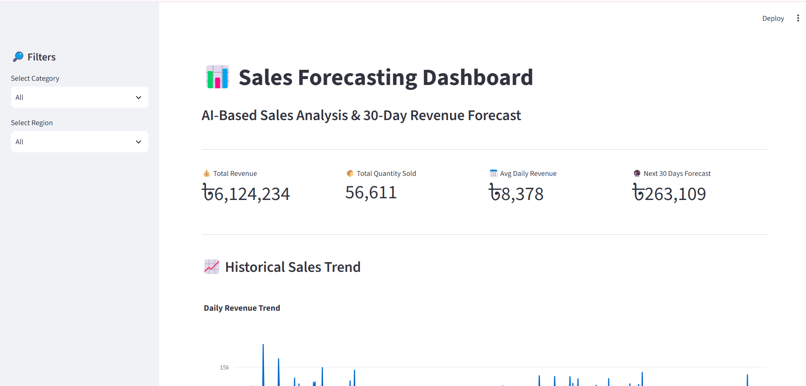

# AI-Based Sales Forecasting and Prediction System

An AI-powered sales forecasting system that analyzes historical sales data, evaluates machine learning models, and predicts future sales revenue using XGBoost.

## 📌 Project Overview

This project uses machine learning and time-series forecasting techniques to analyze historical sales data and predict future revenue.

The system includes:

- Data preprocessing and cleaning
- Exploratory Data Analysis (EDA)
- Feature engineering
- Machine learning model comparison
- Time-series forecasting using XGBoost
- 30-day future sales prediction
- Interactive Streamlit dashboard

## 🎯 Objectives

- Analyze historical sales performance
- Identify sales trends and patterns
- Compare different machine learning models
- Forecast future daily revenue
- Provide an interactive dashboard for business insights

## 🤖 Machine Learning Models

The project uses and compares:

1. Linear Regression
2. Random Forest Regressor
3. XGBoost Regressor

For time-series forecasting, XGBoost is trained using lag and rolling-window features.

## 📊 Forecasting Features

The forecasting model uses features such as:

- Year
- Month
- Day
- Day of Week
- Weekend Indicator
- Lag 1 Day
- Lag 7 Days
- Lag 14 Days
- Lag 30 Days
- 7-Day Rolling Average
- 30-Day Rolling Average

## 📈 Model Evaluation

The models are evaluated using:

- MAE — Mean Absolute Error
- RMSE — Root Mean Squared Error
- MAPE — Mean Absolute Percentage Error

The project also visualizes:

**Actual vs Predicted Revenue**

## 🔮 30-Day Sales Forecast

The trained XGBoost forecasting model generates a 30-day future revenue forecast using recursive time-series prediction.

The forecast results are stored in:

```text
future_30_day_forecast.csv

🖥️ Streamlit Dashboard

The project includes an interactive Streamlit dashboard with:

Total Revenue
Total Quantity Sold
Average Daily Revenue
30-Day Forecast
Historical Revenue Trend
Product-wise Revenue
Category-wise Revenue
Region-wise Revenue
Actual vs Predicted Revenue
Future 30-Day Forecast
Forecast Data Download

🛠️ Technologies Used
Python
Pandas
NumPy
Scikit-learn
XGBoost
Plotly
Streamlit
Joblib
Git & GitHub

📁 Project Structure
Sales_Forecasting_Project/
│
├── app.py
├── sales_data.csv
├── test_predictions.csv
├── future_30_day_forecast.csv
├── sales_forecasting_model.pkl
├── requirements.txt
└── README.md

🚀 How to Run
1. Clone the repository
git clone https://github.com/tithimec/sales-forecasting-project.git
2. Open the project folder
cd sales-forecasting-project
3. Install dependencies
pip install -r requirements.txt
4. Run the Streamlit dashboard
streamlit run app.py

The dashboard will open in your browser.

🔮 Future Improvements
Add real-world sales datasets
Add more advanced forecasting models
Add product-level forecasting
Add automated model retraining
Deploy the Streamlit application online
Add advanced business analytics

👩‍💻 Author

Jannatul Ferdous Tithi

AI Content Creator | Machine Learning Enthusiast
# AI-Based Sales Forecasting and Prediction System

An AI-powered sales forecasting system that analyzes historical sales data, evaluates machine learning models, and predicts future sales revenue using XGBoost.

## 📌 Project Overview

This project uses machine learning and time-series forecasting techniques to analyze historical sales data and predict future revenue.

The system includes:

- Data preprocessing and cleaning
- Exploratory Data Analysis (EDA)
- Feature engineering
- Machine learning model comparison
- Time-series forecasting using XGBoost
- 30-day future sales prediction
- Interactive Streamlit dashboard

## 🎯 Objectives

- Analyze historical sales performance
- Identify sales trends and patterns
- Compare different machine learning models
- Forecast future daily revenue
- Provide an interactive dashboard for business insights

## 🤖 Machine Learning Models

The project uses and compares:

1. Linear Regression
2. Random Forest Regressor
3. XGBoost Regressor

For time-series forecasting, XGBoost is trained using lag and rolling-window features.

## 📊 Forecasting Features

The forecasting model uses features such as:

- Year
- Month
- Day
- Day of Week
- Weekend Indicator
- Lag 1 Day
- Lag 7 Days
- Lag 14 Days
- Lag 30 Days
- 7-Day Rolling Average
- 30-Day Rolling Average

## 📈 Model Evaluation

The models are evaluated using:

- MAE — Mean Absolute Error
- RMSE — Root Mean Squared Error
- MAPE — Mean Absolute Percentage Error

The project also visualizes:

**Actual vs Predicted Revenue**

## 🔮 30-Day Sales Forecast

The trained XGBoost forecasting model generates a 30-day future revenue forecast using recursive time-series prediction.

The forecast results are stored in:

```text
future_30_day_forecast.csv

🖥️ Streamlit Dashboard

The project includes an interactive Streamlit dashboard with:

Total Revenue
Total Quantity Sold
Average Daily Revenue
30-Day Forecast
Historical Revenue Trend
Product-wise Revenue
Category-wise Revenue
Region-wise Revenue
Actual vs Predicted Revenue
Future 30-Day Forecast
Forecast Data Download

🛠️ Technologies Used
Python
Pandas
NumPy
Scikit-learn
XGBoost
Plotly
Streamlit
Joblib
Git & GitHub

📁 Project Structure
Sales_Forecasting_Project/
│
├── app.py
├── sales_data.csv
├── test_predictions.csv
├── future_30_day_forecast.csv
├── sales_forecasting_model.pkl
├── requirements.txt
└── README.md

🚀 How to Run
1. Clone the repository
git clone https://github.com/tithimec/sales-forecasting-project.git
2. Open the project folder
cd sales-forecasting-project
3. Install dependencies
pip install -r requirements.txt
4. Run the Streamlit dashboard
streamlit run app.py

The dashboard will open in your browser.

🔮 Future Improvements
Add real-world sales datasets
Add more advanced forecasting models
Add product-level forecasting
Add automated model retraining
Deploy the Streamlit application online
Add advanced business analytics

👩‍💻 Author

Jannatul Ferdous Tithi

AI Content Creator | Machine Learning Enthusiast

## 📊 Dashboard Preview

The project includes an interactive Streamlit dashboard for analyzing historical sales data and forecasting future revenue.

